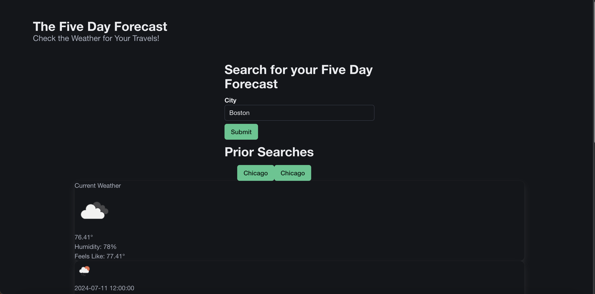
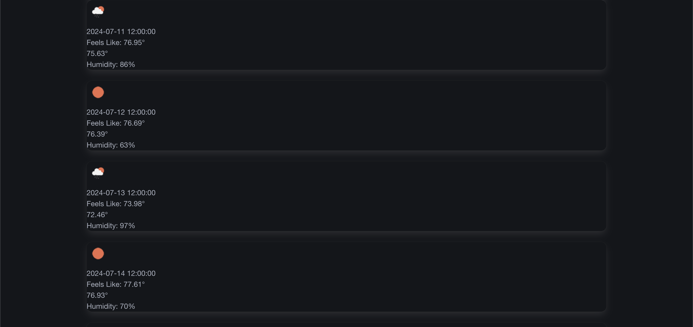

# week-six-challenge-karenas
Challenge Assignment for Week 6 of Bootcamp (Server Side APIs)

Purpose:

The purpose of this project is to present the current weather and the five day forecast for a user, so they can plan their travels.

Functionality:

Users can input a city into a search form. That data is then fed through two API based functions which create one Current Weather Banner and one Five Day Forecast.
Goals Accomplished:

Users are able to view weather information like temperature, wind, and conditions.

Notes:

I refactored code from class materials and had a tutor help

This project is deployed using gitHub pages at https://katherinearenas.github.io/week-six-challenge-karenas/

These are some screenshots of the App.

