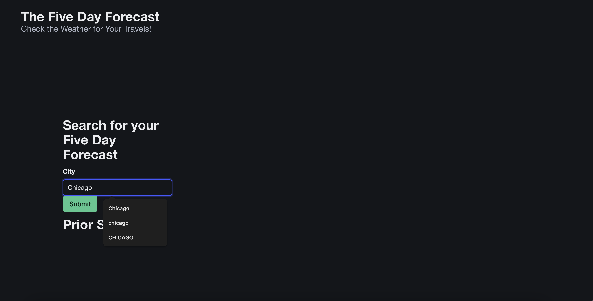
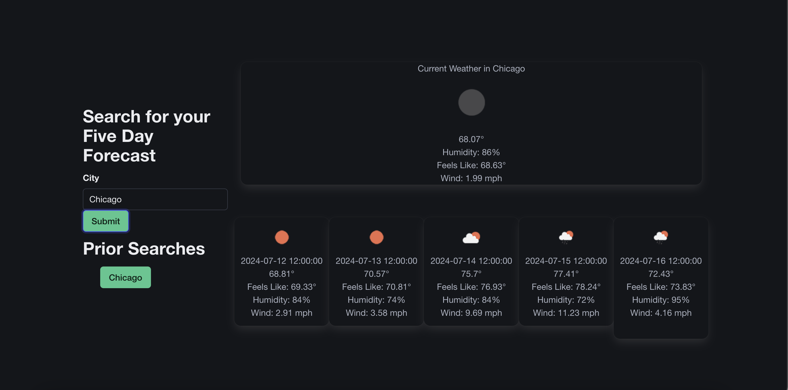
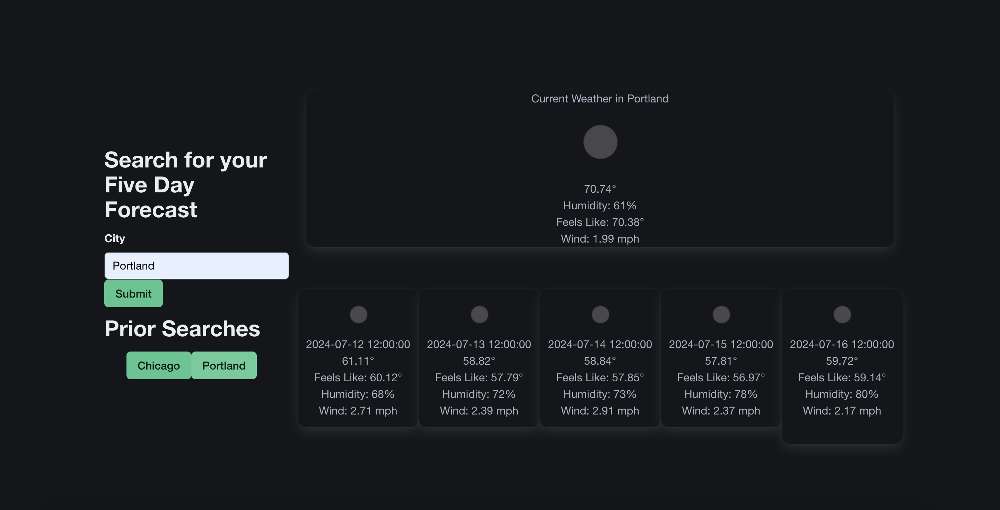

# week-six-challenge-karenas
Challenge Assignment for Week 6 of Bootcamp (Server Side APIs)

<strong>Purpose:</strong>

The purpose of this project is to present the current weather and the five day forecast for a user, so they can plan their travels.

<strong>Functionality:</strong>

Users can input a city into a search form. That data is then fed through two API based functions which create one Current Weather Banner and one Five Day Forecast. Their searches are saved to local storage and rendered as buttons on the page as they click sumbit. If the search is already in the search history, weather report is displayed, but the term is not added to the search history
<strong>Goals Accomplished:</strong>

Users are able to view weather information like temperature, wind, and conditions.

<strong>Notes:</strong>

I refactored code from class materials, bulma materials and had my instructor and had a tutor help me debug.

This project is deployed using gitHub pages at https://katherinearenas.github.io/week-six-challenge-karenas/

These are some screenshots of the App.

